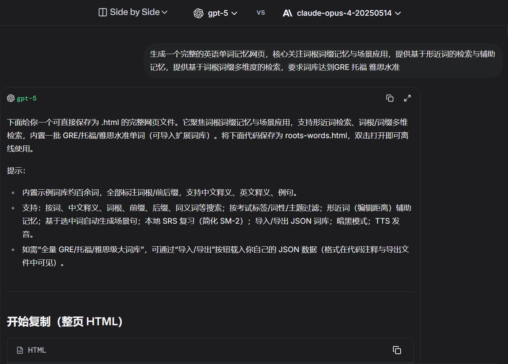
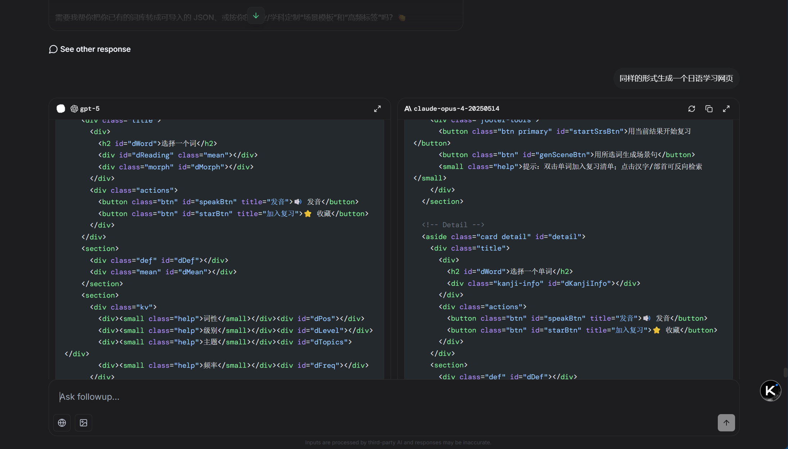
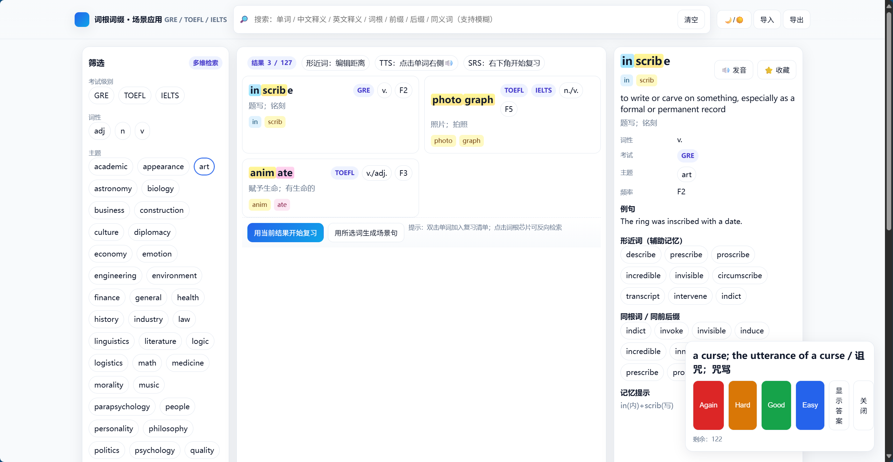
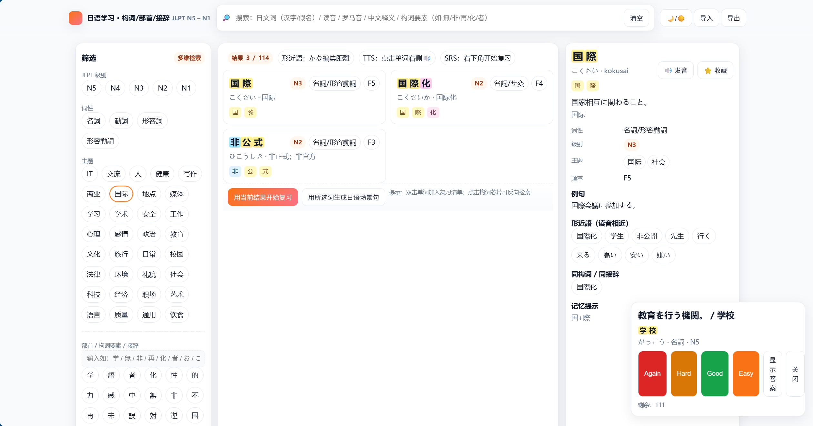
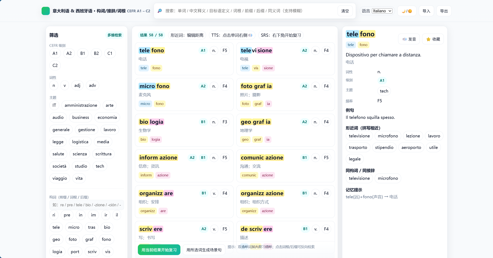
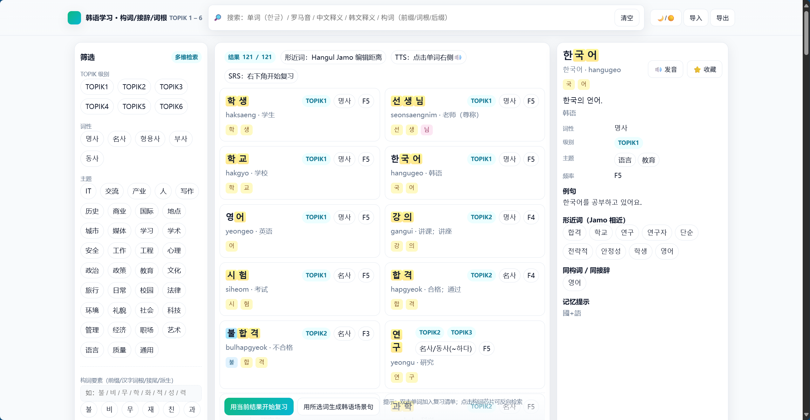
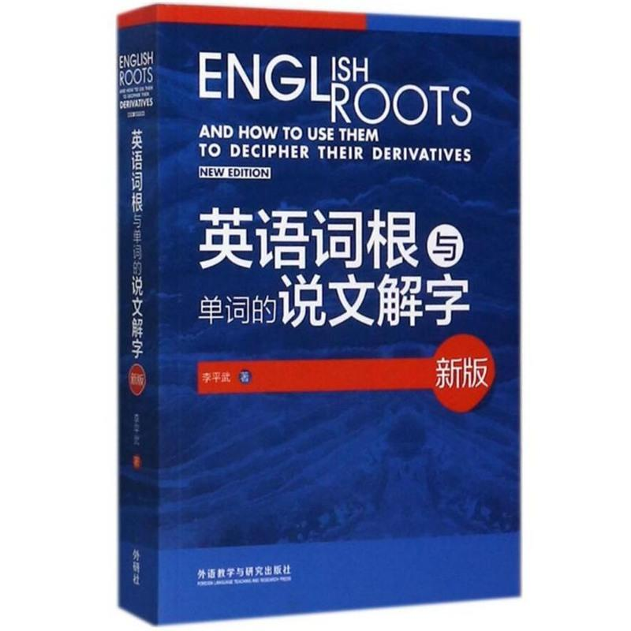

# GPT5生成的单词记忆DEMO

## 作者自述

GPT5的发布重燃了过去一年消沉的激情，在LMarena上随手写下未经设计的Prompt浅做尝试，遂有此项目。一个简单的单词记忆DEMO，点击即用，贯彻我自高中坚持的词根词缀单词记忆法。

在线体验DEMO：
[https://siupal.github.io/ShuoWen/](https://siupal.github.io/ShuoWen/)
离线体验：
将文件保存为 `xx.html`，浏览器打开即可离线使用。

声明

所有内容（HTML代码，词库）由发布于北京时间2025-08-08的GPT5生成，数据存储于本地，暂时无持久化存储也不会联网。不对数据来源负责，不对词库词根词缀的准确性负责，无法提供西语意大利语韩语的校正。

### 快速导航

- 英语 DEMO: [en.html](en.html)
- 西/意 DEMO: [es_It.html](es_It.html)
- 日语 DEMO: [jp.html](jp.html)
- 韩语 DEMO: [ko.html](ko.html)

## 各页面说明（可展开查看）
> 说明均为 GPT 生成并轻度整理，点击每一节标题展开/收起。

<strong>en.html · 英语 DEMO</strong>

### 使用说明与扩展建议

#### 本地使用

将文件保存为 `en.html`，浏览器打开即可离线使用。支持发音（需浏览器 TTS）。

#### 搜索与筛选

* 顶部搜索框：可搜单词、中文释义、英文释义、词根、前缀、后缀、同义词，支持空格组合检索。
* 左侧多维筛选：考试标签、词性、主题、频率；词根/词缀支持“仅词根”“必须全部包含”等逻辑。

#### 形近词

打开某个单词后，右侧将根据编辑距离给出形近词列表，适合对比辨析。

#### 同根/同缀

点击详情页词根芯片，可反向检索同根词族。

#### 场景应用

点击“用所选词生成场景句”，会基于当前筛选/选择生成数句学术、校园、讨论、商务等场景句（模板驱动，可继续自行扩展模板）。

#### SRS 复习

点击“用当前结果开始复习”，采用简化 SM-2。支持 Again / Hard / Good / Easy 四档，复习计划存储在本地 LocalStorage。

#### 导入/导出

* 点击“导入”选择 JSON 文件；
* 点击“导出”可导出当前词库（含你新增或合并的数据）。

#### JSON 数据格式

每个单词对象支持字段 word, pos, level[], frequency, definition_en, meaning_zh, examples[], roots[{m,t}], topics[], syn[], ant[], notes。roots 中 m 为词素字符串（如 bene、pre、-logy），t 为 "prefix"|"root"|"suffix"。

#### 词库扩展到“大词量”（建议）

你可以将全量 GRE/托福/雅思词库整理为上述 JSON 格式后导入；网页会自动索引、支持形近词计算与词根检索。

#### 自定义优化（按需）

* 提升形近词：可将编辑距离与双字母重叠（bigram）相结合，或增加键盘邻近性权重。
* 更丰富的场景：在 generateScene 函数中增加模板，按 topic 更精细地填词；或加入完形填空/同义替换题型。
* 更强的词根高亮：为 roots 中的每个 morpheme 增加 surface 字段（词形表面形式），可更精准高亮如 miss/mit、vis/vid 的同源变体。

<strong>jp.html · 日语 DEMO</strong>

### 使用说明与扩展建议

#### 本地使用

保存为 jp.html，用浏览器打开即可。发音使用系统 TTS（ja-JP）。

#### 搜索与筛选

顶部搜索支持：

* 单词（汉字/假名）
* 读音
* 罗马音
* 中文释义
* 构词要素（部首/接头/接尾）

左侧可按 JLPT 级别、词性、主题、频率筛选；“仅匹配词干/汉字部件”可专注部首/词干；可设置“必须全部包含”。

#### 形近語

按读音（かな）计算编辑距离，更利于近音辨析与记忆。

#### 同构词族

点击详情里的构词芯片（如 化/者/性/無/非/再…）可反向检索同族词。

#### 场景句

点击“用所选词生成日语场景句”，提供校园/职场/社会/IT 等模板句（可在 generateScene 中扩展更多模板或品类）。

#### SRS 复习

右下角开始。Again/Hard/Good/Easy 四档，采用简化 SM-2 算法，计划保存在本地 LocalStorage。

#### 导入/导出

点击“导入”选择 JSON 文件；“导出”导出当前词库。（可查看导入/导出的JSON格式）

#### JSON 格式字段

* word
* reading
* romaji
* pos
* level[]
* frequency
* definition_ja
* meaning_zh
* examples[]
* roots[{m,t}]
* topics[]
* syn[]
* ant[]
* notes

### 自定义与进阶

#### 构词要素

可继续补充更多接辞（〜的に、〜らしい、〜っぽい 等）与部首（氵/扌/忄/亻/辶…），或为动词加入活用形（ます形/て形）字段，增强场景生成的自然度。

#### 形近词算法

可在读音 Levenshtein 上叠加拍/音节 bigram 相似度、或键盘邻近性权重（平假名键位）。

#### 主题标签

按你的学习目标（商务日语/留学/旅游/IT 开发）定制 topic 标签与高频星级。

<strong>es_It.html · 西/意 DEMO</strong>

### 使用说明与扩展建议

#### 本地使用

保存为 `it-es.html`，双击打开即可离线使用。TTS 自动随语言切换 `it-IT` / `es-ES`。

#### 搜索与筛选

- 顶部搜索支持：单词、中文释义、目标语定义、构词要素（前缀/词根/后缀）、同义词、话题；支持空格组合检索。
- 左侧可按 CEFR 级别、词性、主题、频率筛选；“仅匹配词根/词干”强调基础词干；“必须全部包含”用于精准交集检索。

#### 形近词

- 按拼写（含重音符）编辑距离给出近形词，便于罗曼语族常见“假朋友”和相似拼写的辨析。

#### 同构词族

- 点击详情中的构词芯片（如 `re-/pre-/tele-/…` / `-zione/-ción/-mente` 等）可反向检索词族。

#### 场景句

- 点击“用所选词生成场景句”，将按语言生成校园/职场/科技/出行等模板句（在 `generateSceneIT/ES` 中可增改模板）。

#### SRS 复习

- 右下角开启，Again/Hard/Good/Easy 四档，采用简化 SM-2；计划按“语言:单词”存储在本地 LocalStorage。

#### 导入/导出

- “导入”选择 JSON；“导出”导出当前语言词库。

#### JSON 字段

- `word`
- `pos`
- `level[]`
- `frequency`
- `definition_it` / `definition_es`（二选一按语言）
- `meaning_zh`
- `examples[]`
- `roots[{m,t}]`
- `topics[]`
- `syn[]`
- `ant[]`
- `notes`

#### 进一步增强（可选）

- 词形字段：为动词加入“变位/时态范式”或派生名词/形容词的自动生成；为名词补充性数（it: -o/-i/-a/-e；es: -o/-a/-os/-as）。
- 相似度：在编辑距离上叠加 n-gram/键盘邻近性；或按发音规则（it：c/g+e/i；es：b/v, c/z/s, ll/y）做等价映射。
- 词库扩展：可导入更大 CEFR 词表或专业词库（商贸/旅游/IT），加入 topic 标签如 `negocios/viaggio/IT/ley/ambiente` 等。

<strong>ko.html · 韩语 DEMO</strong>

### 使用说明与扩展建议

#### 本地使用

* 保存为 ko.html，用浏览器打开即可。发音使用系统 TTS（ko-KR）。

#### 搜索与筛选

* 顶部搜索支持：词形（한글）、罗马音、中文释义、韩文释义、构词要素（前缀/词根/后缀）、同义词。
* 左侧可按 TOPIK 级别、词性、主题、频率筛选；“仅匹配词根/词干”专注汉字词构词；“必须全部包含”做交集筛选。

#### 形近词

* 将音节分解为 Hangul Jamo 做编辑距离，更贴近发音/拼写混淆的辨析。

#### 同构词族

* 点击详情里的构词芯片（如 불-/비-/무-/… / -적/-성/-화/-력 等）可反向检索词族。

#### 场景句

* 点击“用所选词生成韩语场景句”，提供校园/研究/会议/社会/IT 等模板句，你也可以在 generateScene 中继续扩展模板。

#### SRS 复习

* 右下角开始，Again/Hard/Good/Easy 四档，简化 SM-2；计划保存在本地 LocalStorage。

#### 导入/导出

* 点击“导入”选择 JSON；“导出”导出当前词库。

#### JSON 格式字段

* word
* reading
* romaja
* pos
* level[]
* frequency
* definition_ko
* meaning_zh
* examples[]
* roots[{m,t}]
* topics[]
* syn[]
* ant[]
* notes

### 进阶定制（可选）

* 添加语法/活用字段（如 -습니다/-아요，时态/尊敬阶）；或给动词自动生成活用练习。
* 形近词优化：在 Jamo 距离基础上加入发音同化/连音规则等等价映射（ㄱ/ㅋ/ㄲ、ㅅ/ㅆ、ㄹ/ㄴ 等）。
* 词库扩展：导入更大 TOPIK 真题/教材词表，补充主题标签（経済/社会/IT/環境/文化/政治）。

## 闲言碎语

<strong>关于韩语</strong>

本人对韩文知之甚少，仅知道这是一种通过单字实现严格注音的表音文字系统。考虑到其大量的汉语借词，或许使用汉语本字作为中文母语者学习的韩文记忆工具会更有效，这似乎是GPT5没有考虑周全的。

<strong>推荐的词根学习资源</strong>

李平武老师的著作《英语词根与单词的说文解字(新版)》对词根词缀讲解颇深，对于系统化记忆单词很有帮助。

另，有一款爱好者开发的词根记忆软件，名为高山词根，仍有下载APK与网页端可找到。搜索引擎检索可找到作者个人站。

<strong>关于AI编程的想法</strong>

关于AI编程（所谓Vibe 编程），争论太多，想理一下自己的想法，开个坑。

<strong>说明</strong>

上面AI写的使用说明还没有校验，我仅仅把GPT5的总结输出调整为了markdown格式。

